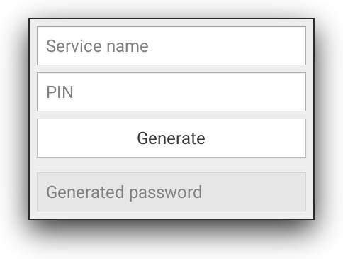

# dpass

A simple, deterministic password generator.

Given a "service name" and a PIN number, generates a password using a user-supplied password generator function.

<p align="center">
  
</p>


An example password generator function is provided in ``dpass_generator.py``:
```python
import hashlib

SECRET = "SECRET"

def generate_example(service_name, pin):
    service_name = service_name.strip() # strip whitespace
    service_name = service_name.replace("http://", "") # strip "http://"
    if service_name[-1] == "/":
        service_name = service_name[:-1] # strip trailing slash

    # password = md5(service_name + SECRET + PIN)
    message = hashlib.md5()
    message.update(service_name.encode("utf-8"))
    message.update(SECRET.encode("utf-8"))
    message.update(pin.encode("utf-8"))
    password = message.hexdigest()

    return password

```

## Setup
Dependencies: GTK+ 3, Python 3, PyGObject

Tested on: Python 3.6.1, PyGObject 3.24.1, Arch GNU/Linux

1. Clone the repository.
2. Edit ``dpass_generator.py``:
    1. Modify the ``SECRET`` variable.
    2. Modify the password generator function: ``generate_example``.
    3. Rename the password generator function ``generate_example`` to ``generate``.

## Usage

### CLI
1. Run ``python dpass.py SERVICE_NAME PIN``.

The generated password is printed to STDOUT.

### GUI
1. Run ``python dpass.py``
2. Fill ``Service name`` field. If there is text present in system clipboard, it is automatically entered into this field at application start.
3. Fill ``PIN`` field with a four-digit number of choice.
4. Press ``RETURN`` or click the ``Generate`` button.

The generated password is placed in the bottom input field. It is selected and copied to system clipboard automatically. The application exits after 3 seconds have passed.